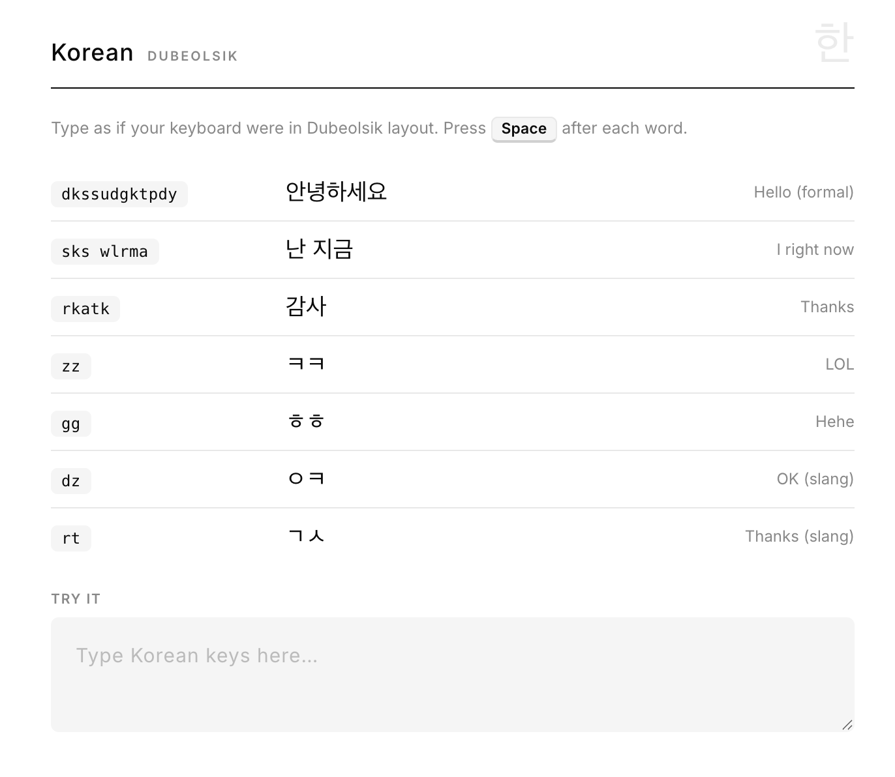
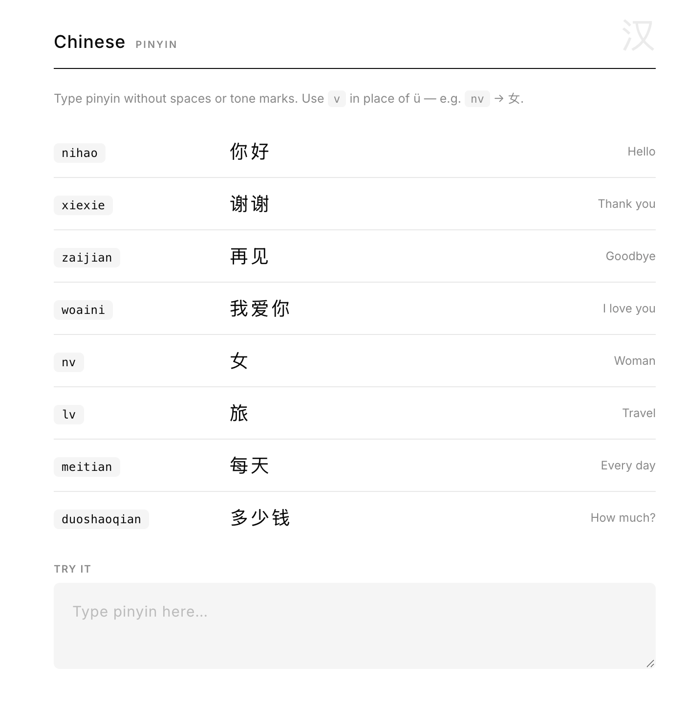
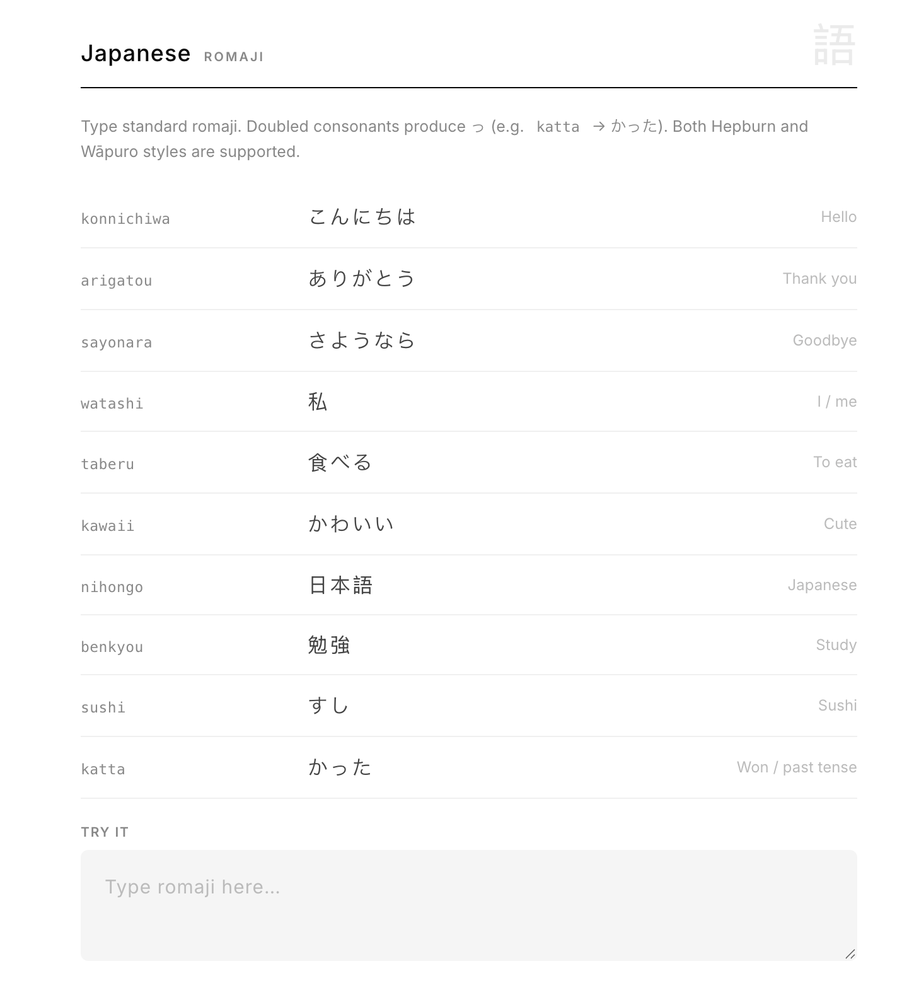

# LangSwitch

LangSwitch is a Chrome extension that fixes mistyped keyboard-layout input directly in text fields. It is built for multilingual typing and works fully locally — no internet required.

## Preview

| Korean (Dubeolsik) | Chinese (Pinyin) | Japanese (Romaji) |
|---|---|---|
|  |  |  |

## Features

- Korean layout correction — English keys → Hangul (Dubeolsik)
- Chinese input — Pinyin → Simplified Chinese characters
- Japanese input — Romaji → Hiragana / Kanji
- Suggestion tooltip + quick apply shortcut (`Alt + L`)
- Optional auto-convert on `Space` / `Enter` / `Tab`
- Context modes: `Strict`, `Balanced`, `Aggressive`
- Korean slang mode (ㅋㅋ, ㅇㅋ, ㄱㅅ, etc.)
- Per-site enable/disable rules
- Theme and appearance settings (Light / Dark / Auto)

## Privacy

- 100% local processing
- No cloud translation
- No remote AI calls
- No typing content sent to external servers

## Project Structure

```text
LangSwitch/
├── manifest.json
├── assets/
│   └── logo.png
├── scripts/
│   ├── converter.js
│   └── content.js
├── ui/
│   ├── popup.html
│   ├── popup.css
│   └── popup.js
├── data/
│   ├── english-words.txt
│   ├── korean-dict.tsv
│   ├── chinese-dict.tsv
│   └── japanese-dict.tsv
└── dev/
    └── test.html
```

## Local Setup

1. Open Chrome and go to `chrome://extensions`
2. Enable **Developer mode**
3. Click **Load unpacked**
4. Select the `LangSwitch` folder

## Quick Test

1. Load `dev/test.html` in Chrome with the extension active
2. Pick a language in the extension popup
3. Type a phrase from the reference table (e.g. `dkssudgktpdy` for Korean, `nihao` for Chinese, `konnichiwa` for Japanese)
4. Press `Space` to auto-convert, or `Alt + L` to apply the suggestion

## Settings

Click the extension icon to configure:

- Language: Korean / Chinese / Japanese
- Context mode: Strict / Balanced / Aggressive
- Auto-convert toggle
- Korean slang mode toggle (Korean only)
- Per-site enable/disable for current domain
- Tooltip theme and appearance

## Permissions (Why)

- `storage`: save user settings
- `tabs` + `activeTab`: get current domain for per-site toggle in popup
- Host access via content scripts: detect/convert in editable fields on pages

## Publishing Notes

- Category: **Tools**
- Keep a public privacy policy URL in the store listing
- If using `<all_urls>`, Chrome Web Store review can take longer due to broad host permissions

## License

Add a license file (`LICENSE`) before release (MIT is a common choice).
