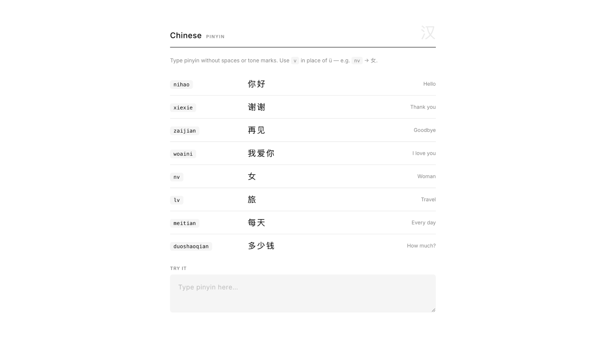
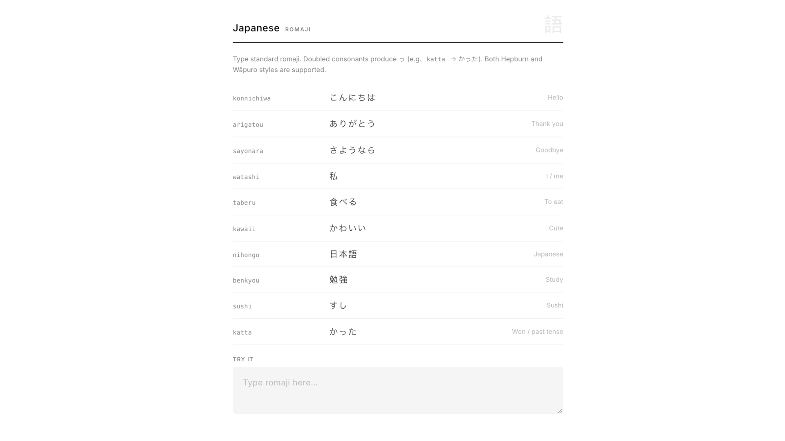
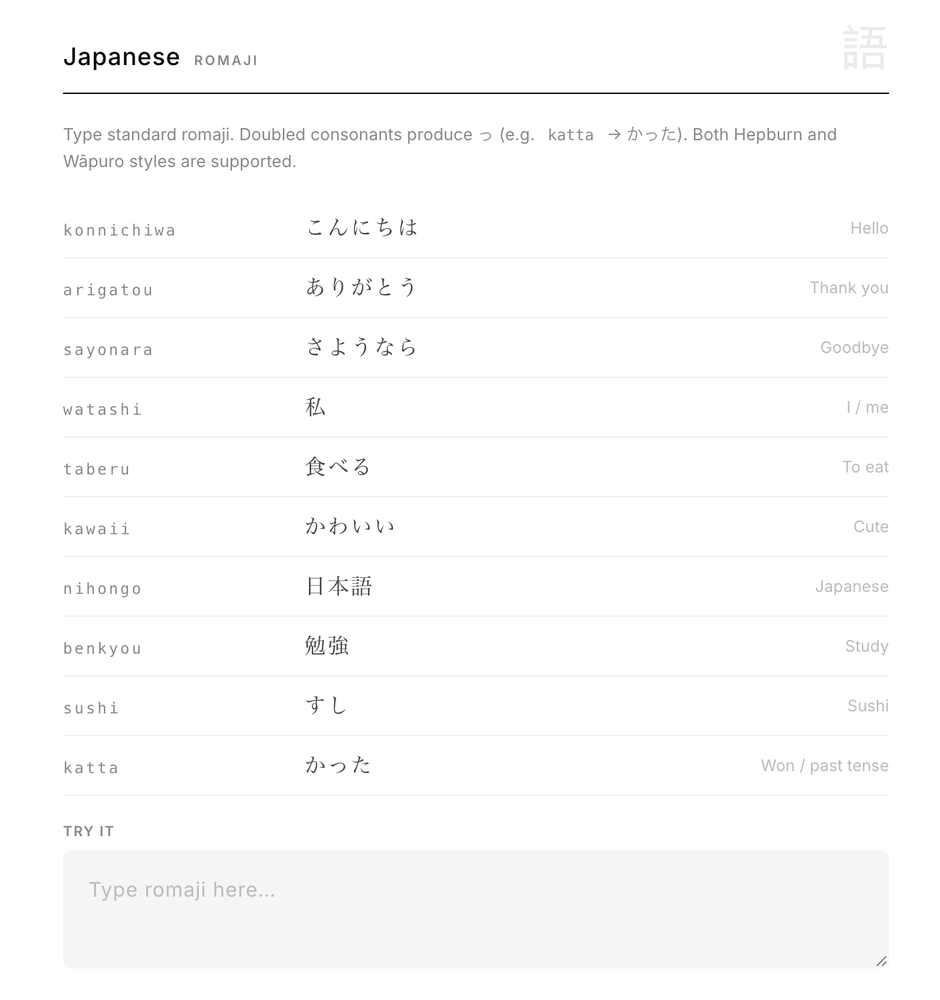

# LangSwitch

A Chrome extension that converts mistyped keyboard-layout input directly in text fields. Built for multilingual typing — works fully locally, no internet required.


## How It Works

Type naturally with your keyboard. LangSwitch detects when your input looks like a mistyped layout and shows a suggestion tooltip. Press `Alt + L` to apply it instantly, or enable auto-convert to have it apply on `Space` / `Enter` / `Tab`.


## Languages

### 🇰🇷 Korean — Dubeolsik

Type English keys as if your layout were Dubeolsik. LangSwitch composes the correct Hangul syllables and recognises common Korean slang (ㅋㅋ, ㅇㅋ, ㄱㅅ, etc.).




### 🇨🇳 Chinese — Pinyin

Type pinyin without spaces or tone marks. Use `v` in place of `ü` (e.g. `nv` → 女, `lv` → 旅) — just like standard Windows IME input.




### 🇯🇵 Japanese — Romaji

Type standard romaji. Doubled consonants automatically produce っ (e.g. `katta` → かった). Both Hepburn and Wāpuro styles are supported.




## Features

- Suggestion tooltip with `Alt + L` quick-apply
- Auto-convert on `Space` / `Enter` / `Tab`
- Context modes — `Strict`, `Balanced`, `Aggressive`
- Korean slang mode (ㅋㅋ, ㅇㅋ, ㄱㅅ, ㄱㄱ, ...)
- Per-site enable / disable rules
- 10 tooltip themes — Light / Dark / Auto

## Privacy

All processing is local. No keystrokes, no content, and no data of any kind is sent to external servers.


## Setup

1. Go to `chrome://extensions` in Chrome
2. Enable **Developer mode**
3. Click **Load unpacked** and select the `LangSwitch` folder

## Quick Test

1. Load `dev/test.html` with the extension active
2. Select a language in the popup
3. Type a phrase from the reference table and press `Space`


## Project Structure

```
LangSwitch/
├── manifest.json
├── assets/
│   ├── logo.png
│   ├── LangSwitch Logo.png
│   └── screenshots/
├── scripts/
│   ├── converter.js
│   └── content.js
├── ui/
│   ├── popup.html
│   ├── popup.css
│   └── popup.js
├── data/
│   ├── english-words.txt
│   ├── korean-dict.tsv
│   ├── chinese-dict.tsv
│   └── japanese-dict.tsv
└── dev/
    └── test.html
```


## Permissions

| Permission | Reason |
|---|---|
| `storage` | Save user settings |
| `tabs` + `activeTab` | Read current domain for per-site toggle |
| Host access | Detect and convert input on any page |


## License

Add a `LICENSE` file before release — MIT is recommended.
